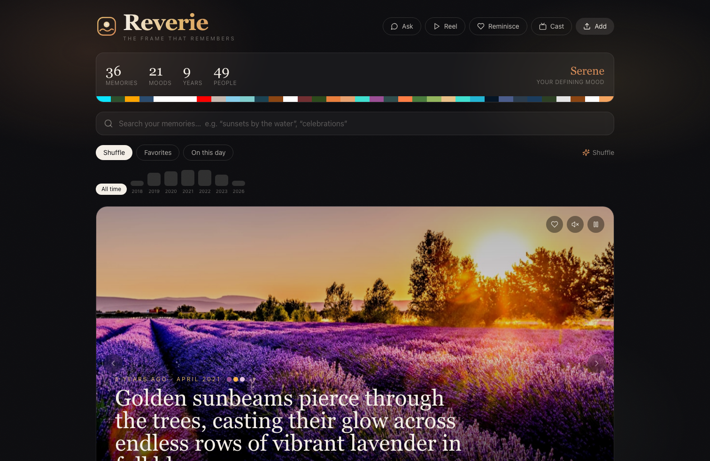
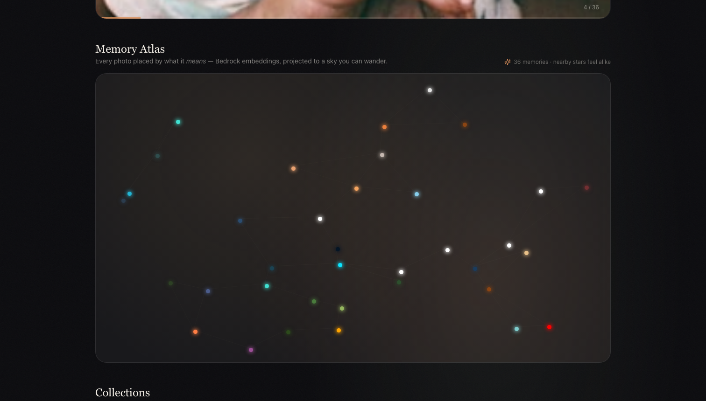
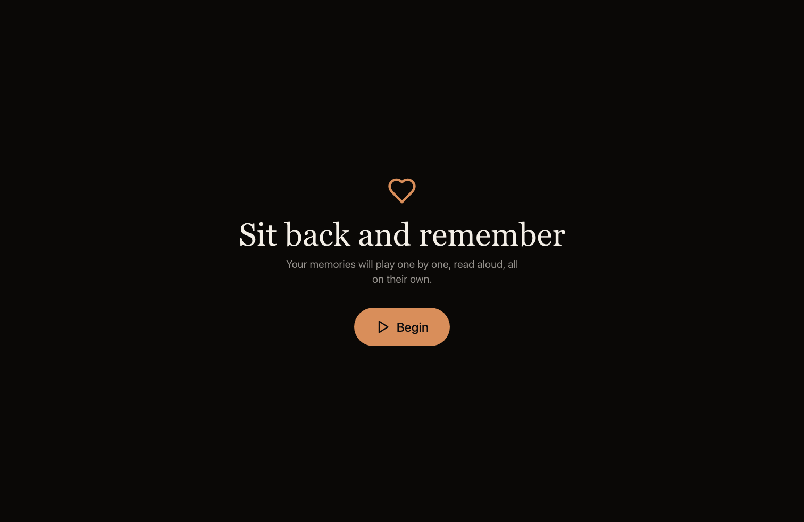
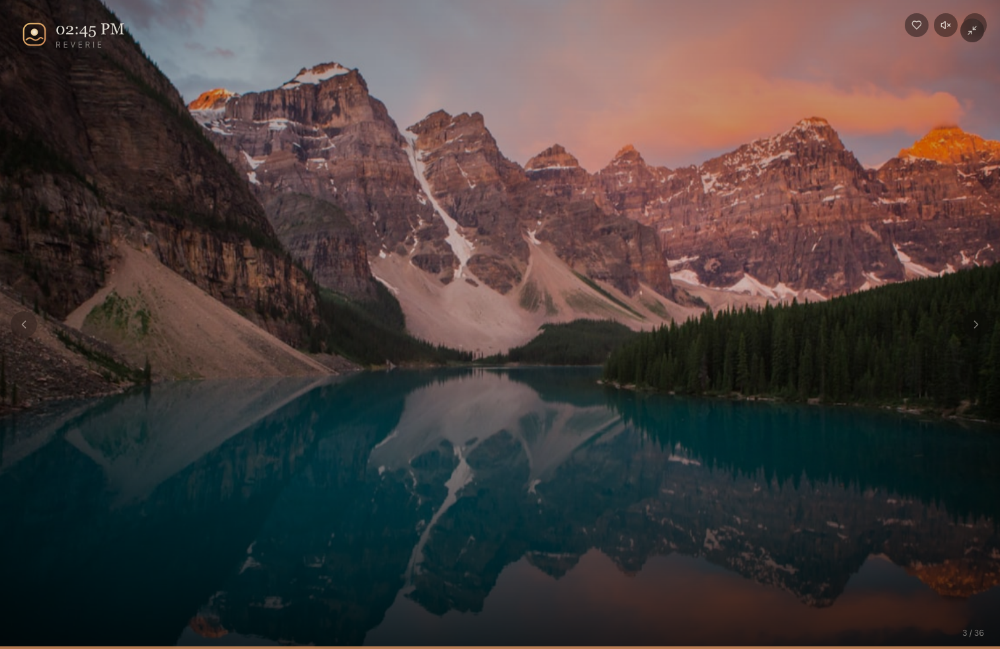

<div align="center">

# Reverie — the frame that remembers

**An AI memory frame that understands your photos, surfaces them by meaning, and reads them back to you in a human voice.**

Built for the H0 Hackathon · *Hack the Zero Stack with Vercel v0 + AWS Databases*

[Live Demo →](https://vm-v0-poojabhavani19-7425-bf27e77c-4w.vusercontent.net/)
</div>

---

## Screens

| The living frame | Memory Atlas |
|---|---|
|  |  |
| **Reminiscence Mode** | **Cast to any screen** |
|  |  |

## What it is

Reverie turns a pile of photos into a living memory. Every photo is understood by
**Amazon Bedrock vision**, embedded with **Titan**, and stored in **Aurora PostgreSQL
+ pgvector**. You can then:

- **Search by meaning** — *"sunsets by the water"* finds the right memories, not filename matches
- **Talk to your memories** — ask *"what beach trips do I have?"* and get a grounded RAG answer
- **Wander the Memory Atlas** — every photo placed in a 2D constellation by what it *means*
- **Hear them aloud** — each memory narrated in a genuinely human voice (ElevenLabs, Polly fallback)
- **Reminiscence Mode** — a calm, large-type, hands-free view built for the people memories matter to most

## The stack

| Layer | Tech |
|---|---|
| Frontend | Next.js 14 (App Router, TypeScript, Tailwind, framer-motion) — built with **v0** |
| API | FastAPI (Python) |
| Database | **Amazon Aurora PostgreSQL Serverless v2** + **pgvector** |
| Vision + Embeddings + RAG | **Amazon Bedrock** — Claude 3.5 Sonnet (vision), Titan embeddings, Claude (text) |
| Retrieval | Hybrid dense (pgvector ANN) + sparse (Postgres FTS) fused with Reciprocal Rank Fusion |
| Voice | ElevenLabs (human narration) · Amazon Polly (fallback) |

See [`architecture.md`](architecture.md) for the full diagram and [`SUBMISSION.md`](SUBMISSION.md) for the demo script.

## Run locally

**API**
```bash
cd api
cp .env.example .env          # fill in DATABASE_URL, AWS creds, ELEVENLABS_API_KEY
pip install -r requirements.txt
python -m app.seed            # optional: seed sample memories
uvicorn app.main:app --reload
```

**Frontend**
```bash
cd frontend
cp .env.local.example .env.local   # set NEXT_PUBLIC_API_URL to your API URL
npm install
npm run dev
```

## Deploy

- **Frontend** → import the `frontend/` directory into Vercel / v0.app. Set
  `NEXT_PUBLIC_API_URL` to your hosted API.
- **API** → host the `api/` FastAPI app anywhere reachable (set the env vars from
  `.env.example`). Point Aurora's security group to allow it.

> Falls back to SQLite + Polly with zero code change when Aurora / ElevenLabs are
> not configured — so it runs anywhere, then lights up fully on real AWS infra.
