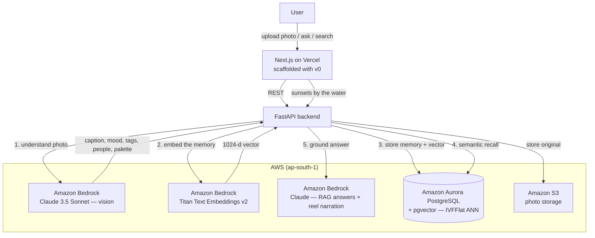

# Reverie — Architecture

> Submission diagram for H0. Frontend on Vercel, **Amazon Aurora PostgreSQL +
> pgvector** as the primary database, **Amazon Bedrock** for multimodal AI.

## System diagram



## The ingestion pipeline (what makes it intelligent)

```
photo ─► Bedrock Claude vision ─► { caption, scene, mood, tags, people, palette }
                                        │
                                        ▼
                        Titan embeds the memory text ─► 1024-d vector
                                        │
                                        ▼
                    Aurora: row + pgvector(embedding_vec) + IVFFlat index
```

## Retrieval (Talk to your memories — RAG)

```
question ─► Titan embed ─► Aurora pgvector ANN (cosine <=>) ─► top-k memories
                                                                     │
                                              Claude answers grounded in them
```

## Data model

| Table   | Key columns |
| ------- | ----------- |
| `photos` | caption, scene, mood, tags[], people, palette[], taken_at, embedding (json), **embedding_vec vector(1024)**, favorite, owner |
| `frames` | name, mode (shuffle/mood/favorites/on-this-day), query, owner |

## AWS services used

| Service | Role |
| ------- | ---- |
| **Amazon Aurora PostgreSQL** | Primary database + **pgvector** semantic memory search |
| **Amazon Bedrock — Claude 3.5 Sonnet (vision)** | Understands every photo |
| **Amazon Bedrock — Titan Embeddings v2** | 1024-d memory vectors |
| **Amazon Bedrock — Claude (text)** | RAG answers + reel narration |
| **Amazon S3** | Original photo storage |
| **Vercel** | Next.js frontend hosting (v0-scaffolded) |

## Environment parity (no code change dev → prod)

```
DEV   sqlite + local fallbacks   (vercel dev)
PROD  Aurora pgvector + Bedrock  (vercel deploy)
```
